### Prerequisites (Your own machine)
This playground uses the following technology so you will need to check they are installed:

- Web Browser
- Code IDE (we use VS Code)
- Docker
- Docker-Compose
- C# .NET 6 from SDK: https://docs.microsoft.com/en-us/dotnet/core/install/
- Terminal (We use Bash)
- Ruby: https://www.ruby-lang.org/en/documentation/installation/
- Pact-Broker cli tool: `gem install --user-install pact_broker-client` || `sudo gem install pact_broker-client`
- git: to clone this repo!

***Network***
The following ports will be used for the application and testing:
- 80 -> pack broker
- 3000 -> backend api
- 9292 -> postgress db for pact broker
- 3001 -> frontend api
- 443 -> some port listed in docker-compose file but we are not going to directly use this one

Pact Broker Url: http://localhost
Backend API: http://localhost:3000/SpiritAnimal
Backend API Swagger: http://localhost:3000/swagger

Remember to change any urls to localhost if you are following on your own machine!

# Getting Started
The playground uses C# .NET 6 with version 4 of pact. Although no existing knowledge of C# .NET will be needed for this playground it could be benificial to have basic knowledge about some terms used for programming. Such as:
- Code block
- Function/Method
- Veriable
- Class

Before getting started, if using our infrastructure be sure to get your instance details and have the following urls open:

- > terminal: http://<YOUR-PANDA>.devopsplayground.org:8080/wetty
- > VS Code: http://<YOUR-PANDA>.devopsplayground.org:8000/?folder=/home/coder

### Good commands to know:
- `cd <dirName>` to move into a directory
- `cd ..` to move out of a directory
- `ls` to list directories and files of your current location
- `pwd` if you get lost where you are in the directories will give full path location
- `dotnet run` to run the backend and frontend APIs
- `dotnet test` to run the pact tests
- `docker-compose up -d` to start the docker containers
- `docker-compose down` to stop the containers

# Introduction
PactNet is a .NET implementation of Pact that allows you to define a pact between two ends of an API connection (or relationship). Pact refers to these as cunsumers and providers. The consumer is the consuming API, otherwise known as the "frontend" API. The provider is the provider of a service being consumer, otherwise known as the backend API.

Pact provides a DSL(Domain Specific Lanugage) for consumers to define the request they will make to a provider along with the response they expect back. This expectation is used to create the mock provider that is then played back to the real provider with the pact file that is produced. 


Example diagram of the relationship architecture from docs.pact.io

# 1. Run the APIs
To run the Backend API first we need to make a quick change to the file `SpiritAnimalBackend/Properties/launchSettings.json` in VS Code. Locate the following key to update in the "SpiritAnimalBackend" object:
```
"SpiritAnimalBackend": {
      "commandName": "Project",
      "dotnetRunMessages": true,
      "launchBrowser": true,
      "launchUrl": "SpiritAnimal",
      "applicationUrl": "http://<YOUR-PANDA>.devopsplayground.org:3000",
      "environmentVariables": {
        "ASPNETCORE_ENVIRONMENT": "Development"
      }
    },
```
You will need to update "applicationUrl" with your instance url.

With this we will be able to run the provider API (SpiritAnimalBackend). Run the following commands to navigate into the correct directory from your teminal.

```
cd SpiritAnimalBackend
dotnet run
```
You should then get output in the terminal similar to the following:

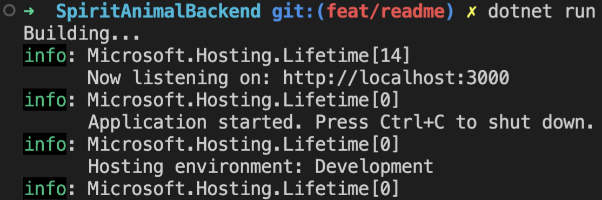

Now open the swagger url in your browser: http://<YOUR-PANDA>.devopsplayground.org:3000/swagger

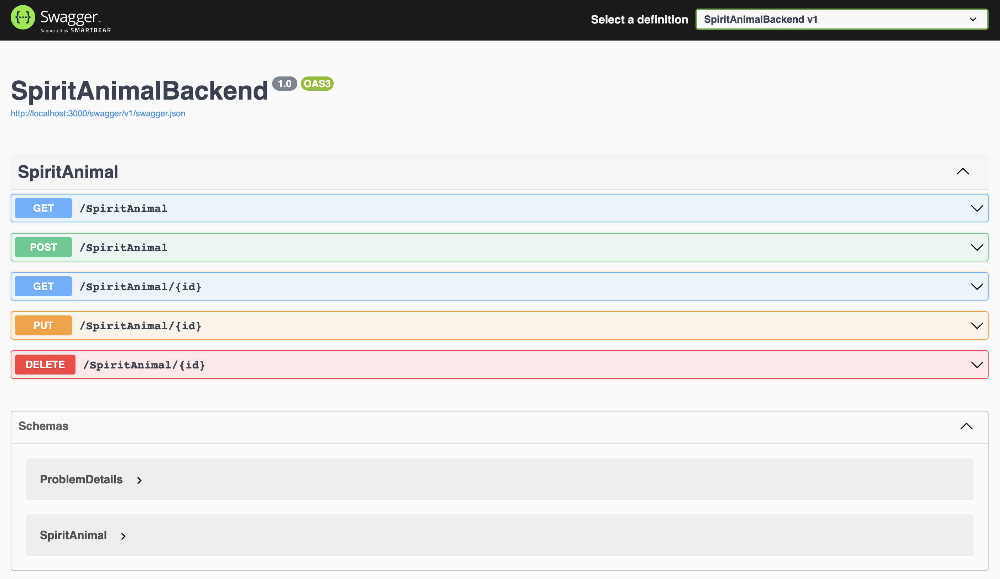

Here we will be able to do a bit of manual testing with the backend api such as POST a spirit animal, GET a spirit animal. We can also see there is ability for PUT and DELETE request handling too.

Let's post a spirit animal by clicking on `POST` and `Try it out`


Fill in the parameters with what you like and click `Execute`. You should get the below showing 201 success and the Spirit Animal object you just created.

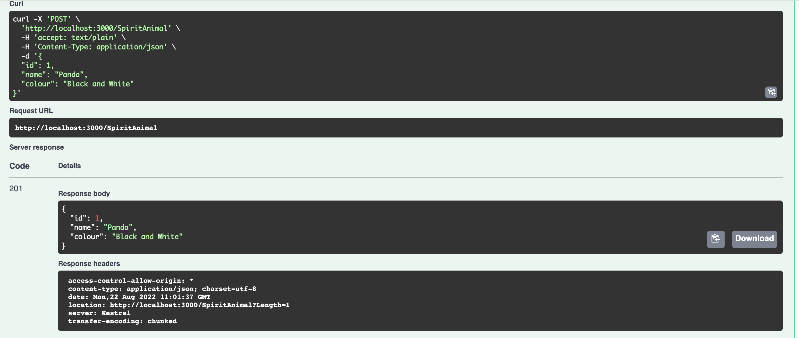

Further confirm your Spirit Animal has been created by running the `GET` request the same way. `Try it out` then `Execute`. Notice that there are no parameters for this method.

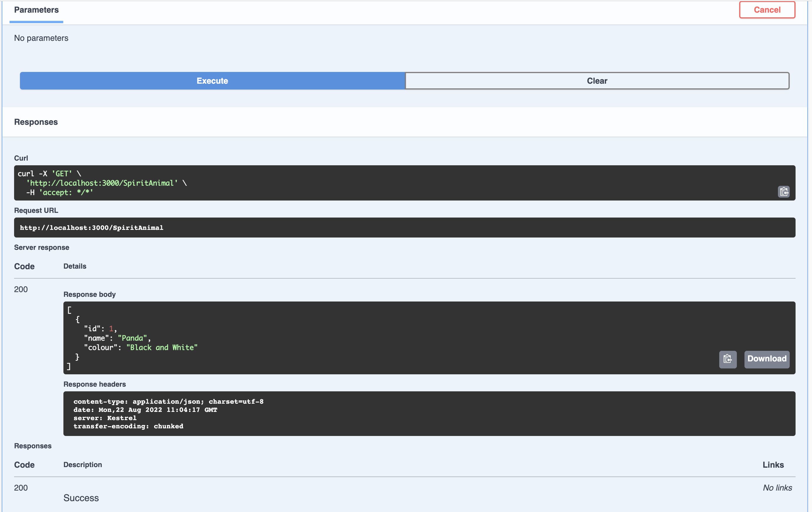

Now lets run the frontend console application that contains the cunsumer side API. For this you will need to open another wetty terminal (just copy and paste the url into a new tab).

```
cd PlaygroundCLI
dotnet run
```

Read through the output into the console. We can see that the Spirit Animal you created earlier has been outputted into the console along with some other spirit animals being created and one being deleted!

This is what it looks like if you stop and restart the backend api and run the frontend again.


# 2. Pact Consumer Tests
Now we have a bit of an idea about the APIs lets get started with writing some of the consumer tests.

A quick overview of the folder structure:
```
.
├── Pact.Consumer.csproj
├── Tests # Tests folder for holding the test files
│   └── SpiritConsumerTest.cs # We will write our tests in here
├── Usings.cs
├── Utils
│   ├── MockProvider.cs # Reusable mock provider for our tests
│   └── XUnitOutput.cs
```

## 2.1 MockProvider
Lets take a quick look at the MockProvider file. We won't be editing this file during the playground but it is good to know what it does. 

***File location -> `/Pact.Consumer/Utils/MockProvider.cs`***
```
protected MockProvider(ITestOutputHelper output)
    {
        var config = new PactConfig
        {
            PactDir = Path.Join(@"../../../../", "pact/pacts"),
            DefaultJsonSettings = new JsonSerializerSettings
            {
                ContractResolver = new CamelCasePropertyNamesContractResolver()
            },
            Outputters = new List<IOutput>
            {
                new XUnitOutput(output)
            },
        };

        MockProviderServer = PactNet.Pact.V3("SpiritAnimalConsumer", "SpiritAnimalProvider", config).UsingNativeBackend(MockServerPort);
    }
```

A quick breakdown of some important lines:
`PactConfig` -> setup of the basic config for the mock server such as pact directory, outputters and default json settings
`PactDir` -> the directory location where we want to save the pact files to. In this case it will be the route of the repository. 

`MockProviderServer = PactNet.Pact.V3("SpiritAnimalConsumer", "SpiritAnimalProvider", config).UsingNativeBackend(MockServerPort);` -> Here we will be using pact specification version 3 for the pact file syntax. We then name the consumer and provider relations for the contract. Pass in the config and finally setup the port for where the mock server will run.

## 2.2 SpiritConsumerTest
After looking at the mock provider now we can move to the test file in `Pact.Consumer/Tests/SpiritConsumerTest.cs` 

Lets go through some of the veriables:
`private readonly Client _client;` -> this is the frontend client that we will be using to make API calls with for our tests
`private const int Port = 3001;` -> the port where the mock server will be running
`private readonly MinMaxTypeMatcher _spiritAnimals;` -> Pact type matcher for lists
`private readonly object _spiritAnimal;` -> the sprit animal object that contains further pact type matchers

### 2.3 GetAllSpiritAnimals Test

Now lets write tests for the GET methods. There are two tests declared in the file `GetAllSpiritAnimals` and `GetSpiritAnimal`.

Fill in the following code for the `GetAllSpiritAnimals` test:

***File location -> `Pact.Consumer/Tests/SpiritConsumerTest.cs`***
```
        // Arange
        MockProviderServer.UponReceiving("A request for all spirit animals")
            .Given("spirit animals exist")
            .WithRequest(HttpMethod.Get, "/SpiritAnimal")
            .WillRespond()
            .WithStatus(HttpStatusCode.OK)
            .WithHeader("Content-Type", "application/json; charset=utf-8")
            .WithJsonBody(_spiritAnimals);

        // Act / Assert
        await MockProviderServer.VerifyAsync(async ctx =>
        {
            var response = await _client.GetSpiritAnimals();
            Assert.Equal(HttpStatusCode.OK, response.StatusCode);
        });
```

There is a lot of code here so lets break down each method. For the "Arrange" code block the following methods are used:

`UponReceiving` -> this is how we are able to distinush between tests. So here you would want to put the test title, i.e. what are you testing.
`Given` -> the text entered here is important later for the provider when setting up states. It will allow the provider to know what it needs to run first before running the pact test.
`WithRequest` -> the method and endpoint we are going to make a request for
`WillRespond` -> now we are going to set up the expected response from the provider
`WithStatus` -> the expected status code to be returned. e.g. 200, 201, 404, etc.
`WithHeader` -> any headers that we expect to be included in the response

`WithJsonBody(_spiritAnimals)` -> this is the body or object we are expecting in the response. Notice that `_spirtAnimals` is being passed in here. Where we set the pact type mtchers against the object.

For the "Act/Assert" code block here we will be making the call to the `MockProviderServer` that is running on port `3001`. 

Only one method is call here; `VerifyAsync` which will start the process to be able to create pact files. Inside the inner code block of this method we will directly call the client's function for `GetSpiritAnimals()` and save the response to a veriable.

As pact is consumer driven we do not need to make too many assertions. Just enough to catch any setup or configuration errors or any changes in the way the consumer makes the requests. 

`Assert.Equal(HttpStatusCode.OK, response.StatusCode);` -> assert that the returned status code (`respoonse.StatusCode`) is 200.

### 2.4 GetSpiritAnimal Test

Copy the following code into the second test in the file `GetSpiritAnimal`.

***File location -> `Pact.Consumer/Tests/SpiritConsumerTest.cs`***
```
        // Arange
        MockProviderServer.UponReceiving("A request for a spirit animals")
            .Given("a spirit animal exists")
            .WithRequest(HttpMethod.Get, "/SpiritAnimal/10")
            .WillRespond()
            .WithStatus(HttpStatusCode.OK)
            .WithHeader("Content-Type", "application/json; charset=utf-8")
            .WithJsonBody(_spiritAnimal);

        // Act / Assert
        await MockProviderServer.VerifyAsync(async ctx =>
        {
            var response = await _client.GetSpiritAnimal(10);
            Assert.Equal(HttpStatusCode.OK, response.StatusCode);
        });
```

Compare this test to the one above that we just did. Can you spot the differences between the two?

## 3. Running the Consumer Tests
Before running the consumer tests, make sure the the backend api is no longer running. Go to your terminal and if it is running do "ctrl+c" key command to end the running process. 

Ensure you are in the `Pact.Consumer` diectory. To check run `pwd` and the nuse the `cd` navigation commands.

Run the following command to run the tests:
```
dotnet test
```

The following output should be displayed in the terminal.

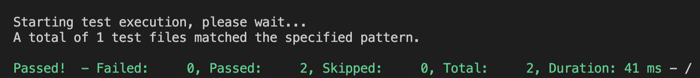

Now if you go to VS Code's explorer you should see a pact folder has been created with a `.json` file. Take a look at this file.

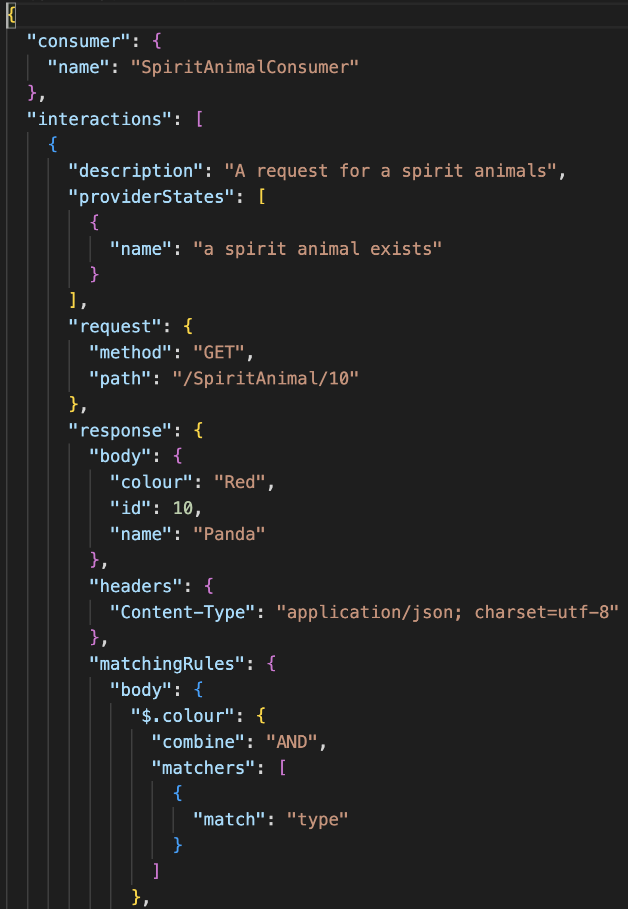

We can see the json object has a couple keys and values included that were specified in the consumer test. Such as Consumer name, description, provider states, request and response. Pact has then generated the type matcher specification for us in the "MatchingRules". We can see that we just specified generic type matches on the values.

# 4. Pact Provider Tests
The pact provider tests themselves are quite small because of the amount of setup we did on the consumer side. We do not need to worry about assertions because this is what the pact file will take care of. 

There is however, quite a bit of complex setup needed for the pact tests to be able to run. For the purpose of this Playground we will only focus on a few of the files. Find these files below in VS Code.

- > `Tests/ProviderApiTest`: This is the provider test file
- > `Middleware/ProviderStateMiddleware`: This is where state setup is handled

## 4.1 Setting Provider States
For the consumer tests we specified some provider states. These need to be setup in the `ProviderStateMiddleware` file. These states will setup the Provider API with the required SpiritAnimals in order to be able to verify the contract between the two APIs. 

Take a look at this code block in the `ProviderStateMiddleware` file.

***File location -> `Pact.Provider/Middleware/ProviderStateMiddleware.cs`***
```
_providerStates = new Dictionary<string, Action>
            {
                { "spirit animals exist", SpiritAnimalsExists},
                { "a spirit animal exists", SpiritAnimalExists }
            };
```
Hopefuly this looks familiar. The strings should match the text used for the Consumer tests in the `Given()` method that we used. 

`SpiritAnimalsExists` and `SpiritAnimalExists` are both functions further down. We need to implement these functions with calling methods on the backendAPI that will add the given spirit animals into the API. 

At the top of the file we delcare a veriable `_repository`. This gives us access to the SpiritAnimalBackend API functions. We can use the following function `_repository.PostSpiritAnimal();` to add SpiritAnimals to the provider API. 

There are some mock spirit animals already created for you that can be accessed with `SpiritAnimalsMock`. 

An example of what the finished functions could look like. Feel free to change the animals for `SpiritAnimalsExists()` but only a maxium of two is allowed based on the specification of the consumer tests.

***File location -> `Pact.Provider/Middleware/ProviderStateMiddleware.cs`***
```
private void SpiritAnimalsExists()
        {
            CleanUp();
            _repository.PostSpiritAnimal(SpiritAnimalsMock.Unicorn);
            _repository.PostSpiritAnimal(SpiritAnimalsMock.Dog);
        }

        private void SpiritAnimalExists()
        {
            CleanUp();
            _repository.PostSpiritAnimal(SpiritAnimalsMock.Panda);
        }
```

## 4.2 Adding Provider Test
With the provider states setup finished, it is time to move onto the `ProviderApiTest` file.

In this file there is a bit of veriable setting and configuration for the following variables:
***File location -> `Pact.Provider/Tests/ProviderApiTest.cs`***
`_providerUri` ->
`_brokerUri` -> will be used later
`_pactPath` -> location of the pact file to run the provider against
`_config` -> a PactVerifierConfig with outputters
`_webHost` -> this will be the running provider with the pact states for the tests in the pact file to run against

As with the Consumer tests, past the following code into the provider test function.

***File location -> `Pact.Provider/Tests/ProviderApiTest.cs`***
```
            // Arrange
            IPactVerifier pactVerifier = new PactVerifier(_config);

            // Act / Assert
            pactVerifier
                .ServiceProvider("SpiritAnimalProvider", new Uri(_providerUri))
                .WithFileSource(new FileInfo(_pactPath))
                .WithProviderStateUrl(new Uri($"{_providerUri}/provider-states"))
                .Verify();
```

On the `pactVerifier` we call a couple of methods:

`ServiceProvider` -> has the provider name we expect from the consumer side and the provider url that will be used
`WithFileSource` -> is the location of the pact file
`WithProviderStateUrl` -> is the url where the provider states will be accessiable to setup before making each call.
`Verify` -> this will run the provider tests and use pact to verify if the contract is upheld.

## 5. Running Provider Tests
*!IMPORTANT* Check both of your wetty terminals for if the `SpiritAnimalBackend` is running. If it is close it with the command `ctrl+c`.

With everything setup and now saved, we can run the provider tests. The final half of our contract tests. 

Run the following commands in your terminal:

```
cd ..
cd Pact.Provider
dotnet test
```

The below output should be visible in the terminal. Notice how descriptive and easy to read each line is for the tests.

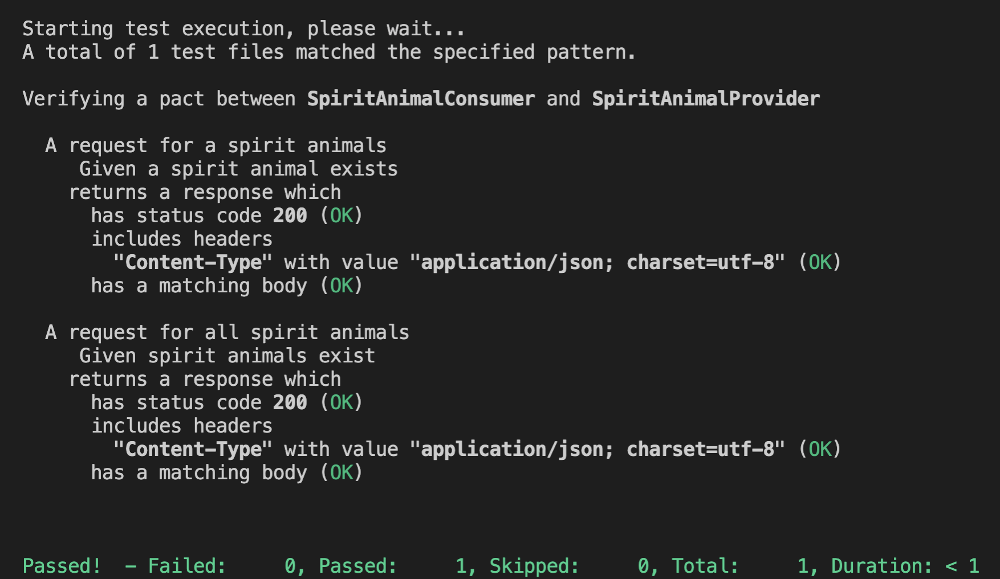

# 6. Breaking the Contracts
We have seen the tests run and pass. Now what happens if the contract is broken?

As pact is a consumer driven testing tool. This means what the consumer specifies is treated as fact.

Lets test the following new requirement:
```
All spirit animals should have a size.
```

With this we will need to edit the following object in the `SpiritConsumerTest` like so:

***File location -> `Pact.Consumer/Tests/SpiritConsumerTest.cs`***
```
_spiritAnimal = new {
            Id = new TypeMatcher(10),
            Colour = new TypeMatcher("Red"),
            Name = new TypeMatcher("Panda"),
            Size = new TypeMatcher("Large")
        };
```
Now we are expecting to recieve a `Size` key on the response from the provider. 

## 7. Run the tests
As the requirements have changed, we now need to run the consumer tests again to update the pact file.
```
cd ..
cd Pact.Consumer
dotnet test
```
The tests should pass and if you check the `pact/pacts/SpiritAnimalConsumer-SpiritAnimalProvider.json` file there should now be `size` added in the expected response body. 

Time to check if the contract is now broken! We will need to run the provider tests to see. Run the following commands:

```
cd ..
cd Pact.Provider
dotnet test
```

This would have produced a lot of output but you should see the following block of text:

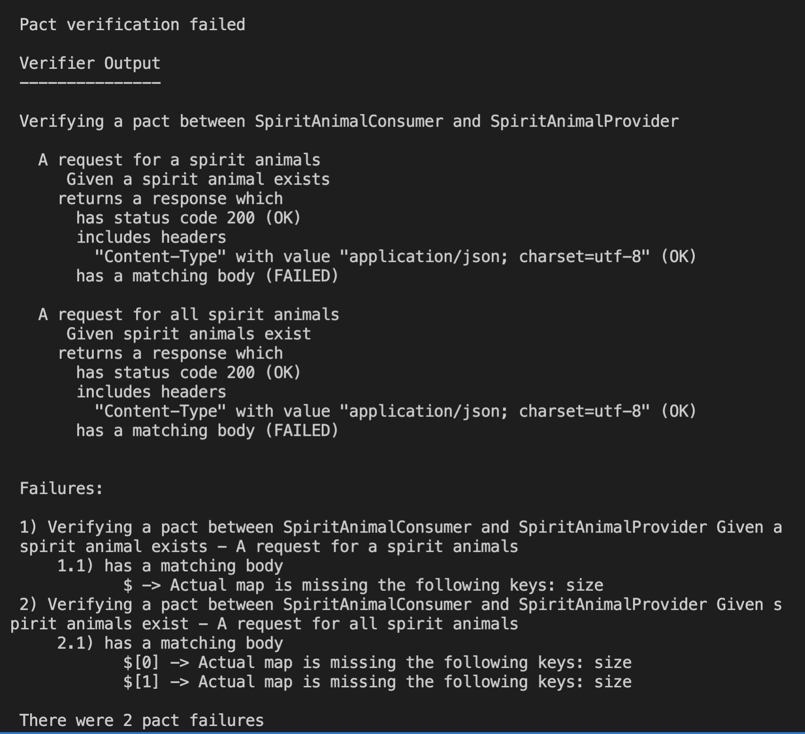

We can see that status code 200 was returned bu the body did not match. further down the reason why is mentioned with the error message: "Actual map is missing the following keys: size" which means that size was not returned in the response from the Provider.
## 8. Revert
Rever the changes to the consumer tests `_spiritAnimal` object by removeing the `Size` key that was added. It should look like the below:

***File location -> `Pact.Consumer/Tests/SpiritConsumerTest.cs`***
```
_spiritAnimal = new {
            Id = new TypeMatcher(10),
            Colour = new TypeMatcher("Red"),
            Name = new TypeMatcher("Panda"),
        };
```

We will need to run the consumer tests one more time to revert the pact file too.

```
cd ..
cd Pact.Consumer
dotnet test
```

# 9. Pact Broker
We have gone over running tests locally with the pact files and also breaking the contract. Next we can see how pact broker could be used for managing the pact files and verifications. 

## 9.1 Setup
Before starting the Pact Broker we will need to make a small change to the `PactBroker/docker-compose.yml` file. In VS Code open the file and update the following:

***File location -> `PactBroker/docker-compose.yml`***
`PACT_BROKER_BASE_URL: 'https://localhost http://localhost http://localhost:9292 http://pact-broker:9292 http://<YOUR-PANDA>.devopsplayground.org http://<YOUR-PANDA>.devopsplayground.org:9292'`

You will need to update `<YOUR-PANDA>` with the correct value for your instance. 

## 9.2 Starting the Pact Broker in docker
```
cd ..
cd PactBroker
docker-compose up -d
```

Check the pact broker is running: http://<YOUR-PANDA>.devopsplayground.org you may notice that there is a default example pact file already there. Feel free to delete this pact file as we will not be using it.

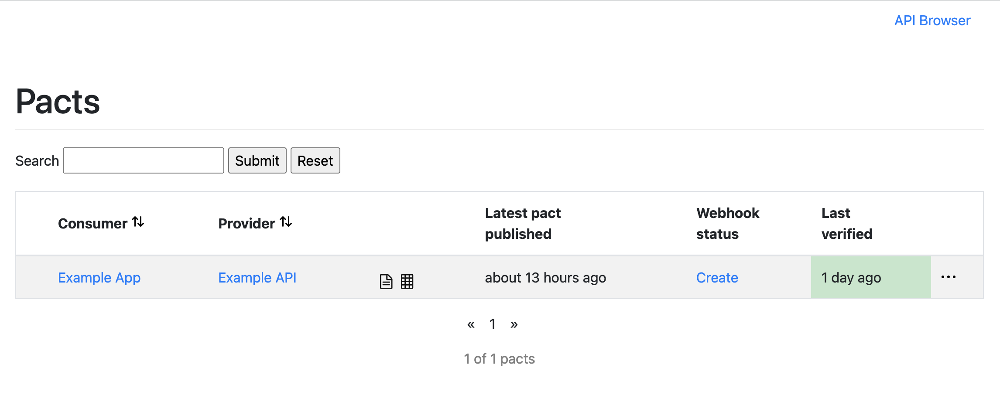

## 9.3 Publishing the Pacts
Now we have our pact broker up and running we will be able to publish the pact files created by the consumer tests. Run the following commands in your terminal:
```
cd ..
pact-broker publish pact/pacts/ --consumer-app-version 1 --broker-base-url http://<YOUR-PANDA>.devopsplayground.org:9292
```

You should get something like the below output: 

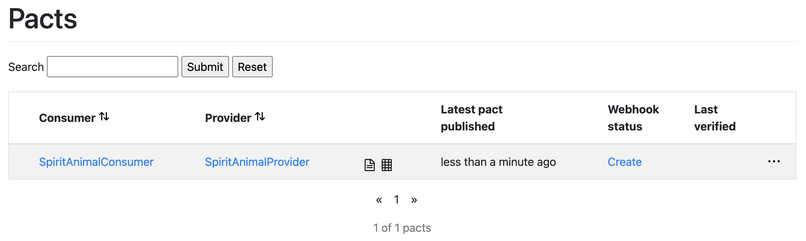

Now if we go to the Pact Broker we can see it has our pact file.
- > http://<YOUR-PANDA>.devopsplayground.org
## 9.4 Verifying Provider Tests

Now that we have our pact files published to the broker we will need to change our Provider tests in order to use this. 

Open the Provider Tests file located at `Pact.Provider/Tests/ProviderApiTest`. Here we will need to update each test's pactVerifier code block with the following:

```
// Arrange
IPactVerifier pactVerifier = new PactVerifier(_config);

// Act / Assert
pactVerifier
    .ServiceProvider("SpiritAnimalProvider", new Uri(_providerUri))
    .WithPactBrokerSource(new Uri(_brokerUri),options =>
    {
        options.ConsumerVersionSelectors(new ConsumerVersionSelector { Latest = true })
        .PublishResults(providerVersion:"1");
    })
    .WithProviderStateUrl(new Uri($"{_providerUri}/provider-states"))
    .Verify();
```

Notice here that we have change the `.WithFileSource` with `.WithPactBrokerSource`. This is where we can provide the url to the pact broker in order for it to use the pact broker API. Inside of this method we also handle specifying the provider version. This is important in order for the Pact Broker to be able to track and successfully verify the contracts.

Now we will run the Provider tests once again by navigating to the `Pact.Provider` folder and running the tests:

```
cd ..
cd Pact.Provider
dotnet test
```

Check the Pact Broker: `http://<YOUR-PANDA>.devopsplayground.org:80` and notice we know have the Last Verified column has been updated and showing green to show success. :tada:

We can further check the verification by clicking through back to the pact file. In the top right you will notice a verified web badge. 

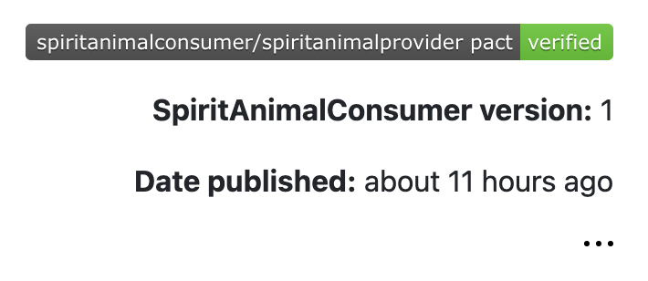

# 10. Bonus | Challenge
## 10.1 Breaking the Contracts
Run the `Pact.Consumer` tests with the same changes we did earlier for breaking the contracts in section `6. Breaking the Contracts`. Publish the pact file again and then run the `Pact.Provider` tests. 

Take a look at how the Pact Broker handles these test failures. 

## 10.2 Want to write more tests?
So far we have only done two basic GET request contract tests to the `SpiritAnimal` endpoint. Looking at the swagger document, we can see there are still `POST`, `PUT` and `DELETE` request methods that could have tests written. 

Using what you have learned from implementing the `GET` tests try to write tests for the other methods of the API that are permitted. 

There is also negative test scenarios that could be tested too. For example when there are no spirit animals to be returned or the requested spirit animal does not exist. 

# References
## Pact
Pact Wiki: https://docs.pact.io/
Pact .NET Example Repo (using old version of pact): https://github.com/DiUS/pact-workshop-dotnet-core-v3/
## Pact Broker
Pact Broker Wiki: https://docs.pact.io/pact_broker
Pact Broker docker-compose file: https://github.com/pact-foundation/pact-broker-docker/blob/master/docker-compose.yml
Pact Broker repo: https://github.com/pact-foundation/pact-broker-docker/blob/master
